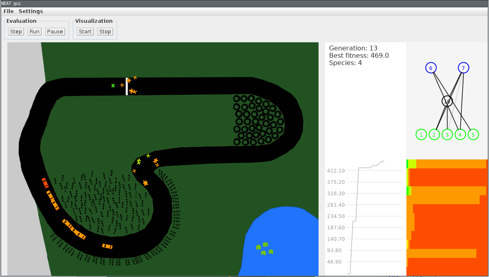

# NEAT Race

Working experiment for the [NEAT](https://github.com/FelixStridsberg/neat) implementation.

Using [NEAT GUI](https://github.com/FelixStridsberg/neat-gui) for visualizing the network.

# Compile and run

#### Unix/Linux/Mac
`./mvnw clean compile exec:java -Dexec.mainClass=com.vadeen.race.gui.Race`

#### Windows
`mvnw.cmd clean compile exec:java -Dexec.mainClass=com.vadeen.race.gui.Race`

## Screenshot

